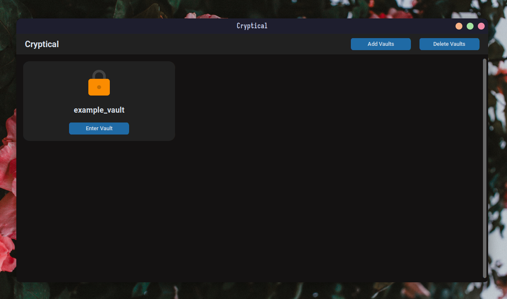
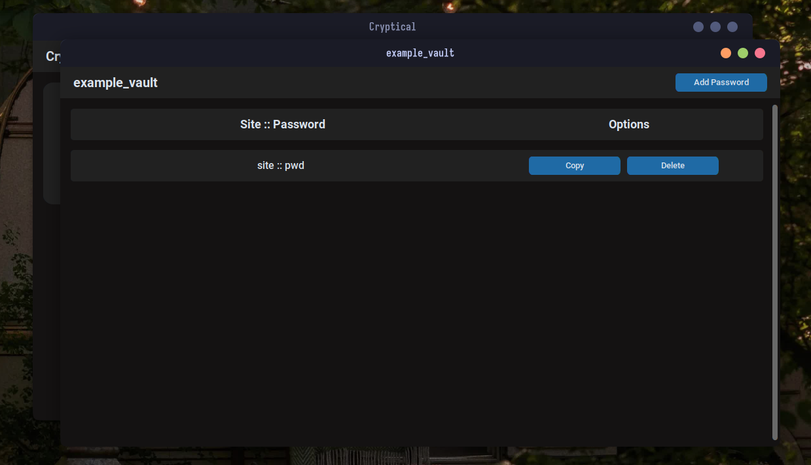

<p align="center">

</p>

Cryptical is a GUI password manager written in Python. It allows users to securely store and manage their passwords, making it easy to access them when needed.

## Previews

<p align="center">


</p>

## Installation

- **Install Python**: If Python and pip are not already installed on your system, you need to install them. You can download and install these from the official website for your operating system.

- **Install dependencies**: cryptical requires libraries like [CustomTkinter](https://github.com/TomSchimansky/CustomTkinter), [Cryptography](https://github.com/pyca/cryptography), and [Pillow](https://github.com/python-pillow/Pillow) for running. You can install these by running the following command in your terminal:

```bash
pip install customtkinter cryptography pillow
```

- **Clone the GitHub repository**: Clone the repository from GitHub using the following command:

```bash
git clone https://github.com/damnitharshit/Cryptical.git
```

- **Run Cryptical**: Once you have installed the necessary dependencies and cloned the repository, navigate to the `src` folder inside the cloned directory and run the `cryptical.py` file using Python:

```bash
python cryptical.py
```

## Usage

When you open Cryptical for the first time, an example vault called `example_vault` will appear. Its password is set to `pwd`.

Vaults are like user accounts, allowing you to create and manage multiple vaults, each with its own unique password. Within each vault, you can store the passwords for various sites and services, ensuring they are kept secure and easy to access.

## Credits

Cryptical uses the following third-party libraries:

- [CustomTkinter](https://github.com/TomSchimansky/CustomTkinter)
- [Cryptography](https://github.com/pyca/cryptography)
- [Pillow](https://github.com/python-pillow/Pillow)

Thanks to the developers of these libraries for their hard work and contributions to the open source community.
